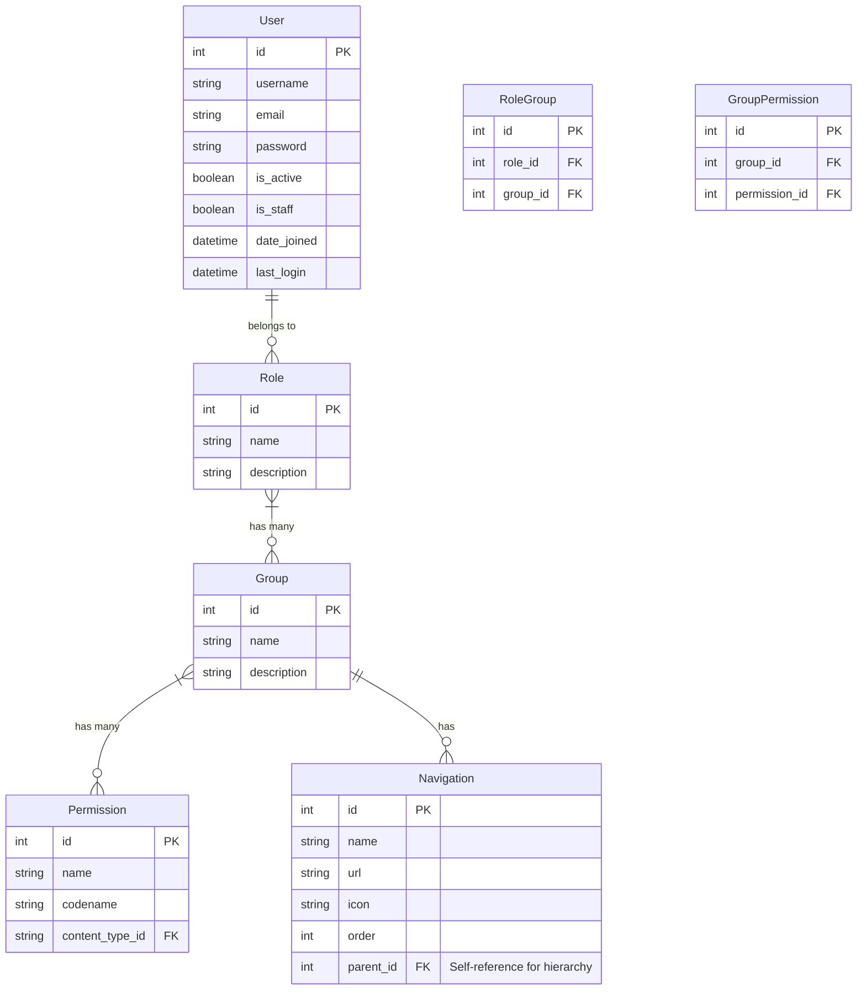

# Estructura de Directorios Propuesta para el CRM Django

```
DjangoProject/                  # Directorio raíz del proyecto
│
├── config/                     # Configuración del proyecto (anteriormente DjangoProject/)
│   ├── __init__.py
│   ├── asgi.py
│   ├── settings/               # Configuraciones separadas por entorno
│   │   ├── __init__.py
│   │   ├── base.py             # Configuración base
│   │   ├── development.py      # Configuración de desarrollo
│   │   └── production.py       # Configuración de producción
│   ├── urls.py                 # URLs principales del proyecto
│   └── wsgi.py
│
├── apps/                       # Aplicaciones del proyecto
│   ├── core/                   # Aplicación principal/núcleo
│   │   ├── __init__.py
│   │   ├── admin.py
│   │   ├── apps.py
│   │   ├── migrations/
│   │   ├── models.py
│   │   ├── tests/              # Tests organizados por tipo
│   │   ├── urls.py
│   │   └── views.py
│   │
│   ├── accounts/               # Gestión de usuarios y autenticación
│   │   ├── __init__.py
│   │   ├── admin.py
│   │   ├── apps.py
│   │   ├── migrations/
│   │   ├── models.py           # Modelos de User, Role, Group, Permission
│   │   ├── api/                # API endpoints
│   │   │   ├── __init__.py
│   │   │   ├── serializers.py
│   │   │   ├── urls.py
│   │   │   └── views.py
│   │   ├── tests/
│   │   ├── urls.py
│   │   └── views.py
│   │
│   ├── customers/              # Gestión de clientes
│   │   ├── __init__.py
│   │   ├── admin.py
│   │   ├── apps.py
│   │   ├── migrations/
│   │   ├── models.py
│   │   ├── api/
│   │   ├── tests/
│   │   ├── urls.py
│   │   └── views.py
│   │
│   └── [otras apps del CRM]/   # Otras aplicaciones específicas del CRM
│
├── static/                     # Archivos estáticos
│   ├── css/
│   ├── js/
│   └── images/
│
├── templates/                  # Plantillas HTML
│   ├── base.html              # Plantilla base con sidebar
│   ├── accounts/              # Plantillas específicas de accounts
│   ├── customers/             # Plantillas específicas de customers
│   └── [otras carpetas]/      # Otras plantillas específicas
│
├── media/                      # Archivos subidos por usuarios
│
├── docs/                       # Documentación del proyecto
│
├── requirements/               # Dependencias del proyecto
│   ├── base.txt               # Dependencias base
│   ├── development.txt        # Dependencias de desarrollo
│   └── production.txt         # Dependencias de producción
│
├── manage.py                   # Script de gestión de Django
├── .env.example                # Ejemplo de variables de entorno
├── .gitignore                  # Archivos a ignorar por Git
└── README.md                   # Documentación principal
```

# Diagrama de Modelos (Mermaid)



# Opinión sobre el Planteamiento

## Fortalezas del Enfoque Propuesto

1. **Extensión del sistema de usuarios de Django**: Es una buena decisión extender el sistema de usuarios de Django en lugar de reemplazarlo completamente. Esto permite aprovechar toda la funcionalidad existente (autenticación, permisos básicos, etc.) mientras se añaden las características específicas necesarias.

2. **Separación de roles y grupos**: La separación entre roles (asignados a usuarios) y grupos (asignados a roles) proporciona una capa adicional de flexibilidad en comparación con usar solo el sistema de grupos de Django.

3. **Navegación dinámica basada en permisos**: La integración de URLs de navegación con los grupos permite crear un sidebar dinámico basado en los permisos del usuario, lo que mejora la experiencia de usuario y la seguridad.

## Recomendaciones

1. **Método de extensión del modelo de usuario**: Para extender el modelo de usuario de Django, recomiendo usar `AbstractUser` en lugar de `OneToOneField` (perfil). Esto permite mantener todas las funcionalidades del usuario de Django mientras se añaden campos adicionales:

   ```python
   from django.contrib.auth.models import AbstractUser
   
   class User(AbstractUser):
       # Campos adicionales aquí
       pass
   ```

   Y luego configurar en settings.py:
   ```python
   AUTH_USER_MODEL = 'accounts.User'
   ```

2. **Relación entre Roles y Grupos**: Considere si realmente necesita ambos conceptos. En muchos casos, los roles de Django (is_staff, is_superuser) junto con los grupos pueden ser suficientes. Si decide mantener ambos, asegúrese de que la distinción sea clara para los desarrolladores y usuarios.

3. **API REST**: Para la API, recomiendo usar Django REST Framework, que se integra perfectamente con el sistema de autenticación y permisos de Django.

4. **Estructura de navegación**: Considere almacenar la estructura de navegación en la base de datos (como se muestra en el modelo Navigation) para permitir una gestión dinámica sin necesidad de cambios en el código.

5. **Caché de permisos**: Implemente un sistema de caché para los permisos y la navegación para evitar consultas repetitivas a la base de datos.

## Consideraciones Adicionales

1. **Rendimiento**: Con relaciones muchos a muchos anidadas (User->Role->Group->Permission), las consultas pueden volverse complejas. Considere usar select_related/prefetch_related y caché donde sea apropiado.

2. **Migración de datos**: Si planea migrar desde un sistema existente, desarrolle un plan claro para la migración de usuarios y permisos.

3. **Pruebas**: Asegúrese de escribir pruebas exhaustivas para el sistema de permisos, ya que es una parte crítica de la seguridad de la aplicación.

4. **Documentación**: Documente claramente cómo funciona el sistema de roles, grupos y permisos para futuros desarrolladores.

Esta estructura y enfoque proporcionan una base sólida para un CRM con Django que utiliza tanto API como templates, con un sistema de permisos flexible y una navegación dinámica basada en esos permisos.